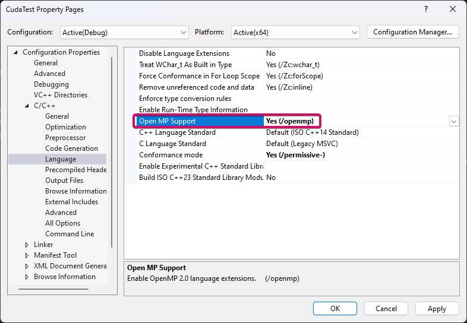
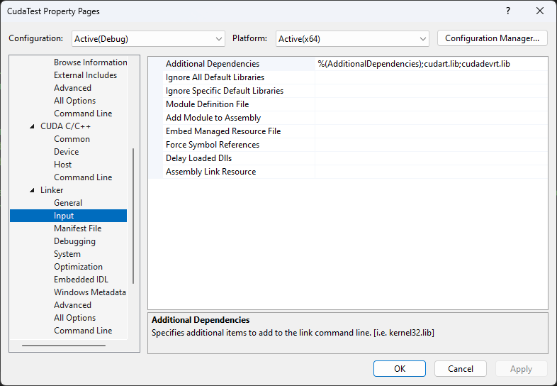

# How to Run the OpenMP Code in WSL (Linux) For 01 to 06

```
g++ main.cpp -o main -fopenmp
```

```
./main
```

# How to Run the Cuda Code in WSL (Linux) For 07

```
nvcc -o 07_cuda_program 07_Matrix_Addition.cpp 07_Cuda_Kernel.cu

```

-o 07_cuda_program: Specifies the output executable file

07_Matrix_Addition.cpp : Your main host program.

07_Cuda_Kernel.cu: Your CUDA kernel code.

```
./07_cuda_program
```

# How to Run the Cuda Code in WSL (Linux) For 08

```
nvcc -o 08_main 08_main.cpp 08_SerialVectorAdd.cpp 08_ParallelVectorAdd.cu
```

```
 ./08_main
```

# How to Run 09

For all Jupyter Notebooks (Ipynb), it is recommended to use Google Colab to run the code.

# How to Run the Cuda Code in WSL (Linux) For 10

```
nvcc -o 10_MatrixMultiply 10_MatrixMultiply.cu
```

```
 ./10_MatrixMultiply
```

# How to Run the Cuda Code in WSL (Linux) For 11

```
nvcc -o 11_MatrixMultiply2d 11_MatrixMultiply2d.cu
```

```
 ./11_MatrixMultiply2d
```

# Debugging for Cuda in WSL (Linux)

Verify GPU Availability

```
nvidia-smi
```

Compile with Debugging Flags (-G)

```
nvcc -G -o 07_cuda_program 07_Matrix_Addition.cpp 07_Cuda_Kernel.cu
```

# How to Run the OpenMP Code in Windows (Visual Studio) For 01 to 06

[Configure OpenMP in Visual Studio](https://www.youtube.com/watch?v=6UIcjxjLXkM)

1. Go to Project Properties
2. Go to C/C++
3. Go to Language
4. Enable OpenMP Support

   

# How to Run the Cuda Code in Windows (Visual Studio) For 07

[Configure Cuda in Visual Studio](https://medium.com/@aviatorx/c-and-cuda-project-visual-studio-d07c6ad771e3)

1. Change Solution configuration to Release and Solution Configuration to x64 (as I am using a 64-bit system)
2. Go to Project > Build Dependencies > Build Customizations, Enable CUDA
3. Go to Project Properties
4. Go to Linker > Input > Additional Dependencies
5. Make sure have %(AdditionalDependencies);cudart.lib;cudadevrt.lib

   
