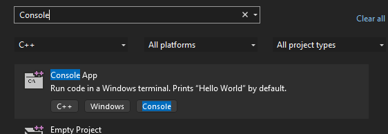

This Repo is my learning on OpenMP, MPI and CUDA in C++

# Intallation for WSL (Linux) for Cuda


1. Open your `~/.zshrc` file:

   ```bash
   nano ~/.zshrc
   ```

2. Add these lines at the end of the file:

   ```bash
   # Add CUDA to PATH, along with Miniconda and local binaries
   export PATH="/usr/local/cuda-12.6/bin:$PATH"

   # Add CUDA libraries to LD_LIBRARY_PATH
   export LD_LIBRARY_PATH="/usr/local/cuda-12.6/lib64:$LD_LIBRARY_PATH"

   ```

3. **Save and exit** the editor (`Ctrl + X`, then `Y`, and `Enter`).
4. **Apply the changes** to the current terminal session:

   ```bash
   source ~/.zshrc
   ```

# Installation for Windows (Visual Studio) for Cuda


# Install Links


# Check the Cuda Version

```bash
nvcc --version
```

# Create a new project in Visual Studio


